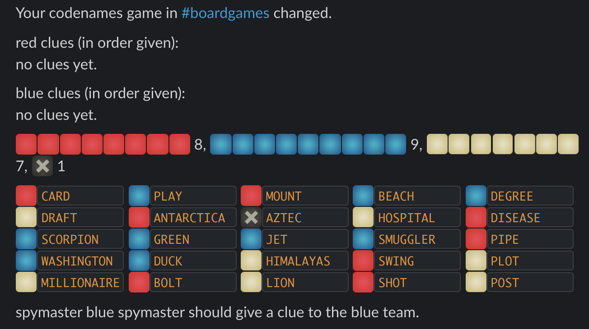

# codenames-redux

A Slack chat bot that facilitates playing the excellent boardgame Codenames!


## Install and Run

You'll need to grab a new Slack "Classic" app token for this bot - sorry, the code is ancient
and uses the deprecated "RTM" API.

Create it here: [Slack: Create Classic App](https://api.slack.com/apps?new_classic_app=1)

Once you've created your app and installed it into your workspace, use the "bot token"
to run the app.

For everything to work correctly, you should also upload all the custom emoji
used by the bot for drawing the board. Here's how my slack emoji settings look:


You can find all the emoji in the [images](./images) directory in the [`codenames-redux` Github repo](https://github.com/justjake/codenames-redux).

### Install & Run using NPM

* Set the PERSIST environment variable to a location where the bot will store its board
  state.

```
npm install -g codenames-redux
PERSIST=/path/to/persistance/dir SLACK_TOKEN=asfajdjfds codenames-redux-slack-bot 
```

### Install & Run using Docker

* Mount a volume at the `/db` path in the container where the bot will store its board
  state.

```
docker run --rm -it --volume /path/to/persistance/dir:/db --env SLACK_TOKEN=your-bot-token-here \
  jitl/codenames-redux:latest
```

## Slack Bot Usage

The bot responds to commands beginning with `cn`. Once you've invited the bot user
to a Slack channel, type `cn help` to get help direct-messaged to you.
Or, type `cn help --here` to print the help in the current channel.

### How to start your first game

1. Invite the bot to the channel
1. Type `cn enable-channel` to create a game lobby for the current slack channel.
   Each channel has a separate game state.
1. Players type `cn join` to enter the game and be automatically assigned to a team.
  * To join a specific team, or to switch teams, type `cn join blue` or `cn join red`.
1. One player from each team should become the spymaster with `cb become-spymaster`
1. Start the game with `cn new-game`

### Gameplay

Please read the [official Codenames rules](https://czechgames.com/files/rules/codenames-rules-en.pdf)!

As the game progresses, public board state will be posted in the slack channel where the game
was started


Each Spymaster recieves the "private" board state with the color of each word revealed in
a direct message



1. In the game channel, the first spymaster (eg, red spymaster) should give a clue of the form `cn give-clue <clue word> <number of guesses>`, eg `cn give-clue toad 3`.
1. The spymaster's team (eg, red) now has four guesses (clue count + 1)
  * Team members can guess a word with `cn guess <word on the board>`.
  * Team members can pass with `cn guess`
  * If the team is AFK or otherwise, someone on any team can make them pass with `cn sudo-pass`.
    Please don't abuse this.
1. Now, it's the other team's turn, starting with the other spymaster

Play continues until one of the teams is victorious.

### Playing again

* To switch up the spymasters, `cn become-spymaster`
* To shuffle teams, `cn shuffle`
* To start a new game, `cn new-game`

## Development

This codebase supports several alternative UIs for the core game logic.

### Other UIs

run `npm test` to start the game. Type commands like `give clue foo 2` to give
`foo 2` as a clue. Visit localhost:1337 for the guesser view. I recommend
putting this on a second computer and letting the guessers stare at it.

The main computer should be used for the spymasters. Put a `watch curl
localhost:1337/spymaster` in one terminal, and leave the game process with the
readline interface in another terminal. Have the guessers relay their guesses to
the spymasters, who do all the computer input.

Here's how it looks:

Playing in "single-game mode" in the terminal:


The start of the web ui:


PLEASE PLEASE PLEASE open a Github issue with suggestions for improvements or
bug reports!
